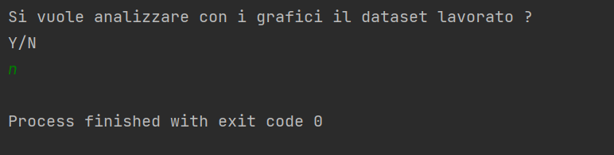
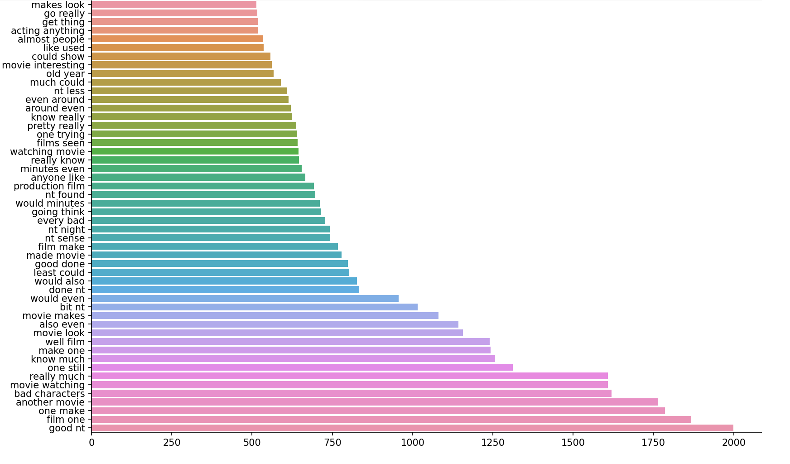

# Analysis_and_processing
 
 __Esegue un analisi statistica del dataset e ha più opzioni:__ 
     
    1)-Unisce due dataset.
    2)-Fa una prima pulizia del dataset.
    3)-Analizza ed eventualmente elimina stop words.
    4)-Lemmatizza

## Le fasi vanno esguite con in ordine altrimenti il dataset di output non sarà attendibile !
## Prima fase:
#### Toglieremo caratteri speciali, siti web, e-mail, codice html e tutte le contratture della lingua inglese.
#### Per prima cosa andiamo nel file first e scriviamo alla prima riga : True.

#### Se desideriamo aggiungere espressioni da sostituire tramite regex dobbiamo aprire il file regex e modificarne il contenuto.
#### La sintassi coretta per la sostituizione è:
#### espressione_da sostituire – espressione_da_sostituire_con_lo_spazio
#### oppure se l'espressione da sostituire ha una sola parola
#### espressione_da sostituire – espressione_da_sostituire ,

#### Successivamente lanciamo Processing.py.

#### Poi inseriamo il seguente Input:

#### Output:

#### Input:

## Seconda fase:
#### Lemmatizziamo sfoltendo un po il datset e sostituendo ogni parola composta con la propria radice
#### Input:

#### Output

#### Input:

## Terza Fase:
#### In questo caso non è neccesaria ma nel caso in cui avessimo pulito e lemmatizzato solo le review positive o 
#### negative, dobbiamo unire il dataset per procedere alla fase di analisi.

## Quarta Fase:
#### Questa è la fase più importante perchè consente di alleggerire molto il dataset lemmatizzato e pulito.
#### Per aggiungere nuove stopwords oltre quelle già presenti nel repository basta aggiungere le parole nei file di testo:

#### Input:

#### Output

#### Possiamo vedere quante review positive e negative ha il dataset ed eseguire word-cloud o una analisi ngrams.
#### Sotto vengono riportate alcune immagini che mostrano l'efficacia delle fasi precedenti e alcune informazioni 
#### preziose per costruire wordlist personalizzate.

### Conteggio review positive e negative:

### Parole più significative per Word Cloud:
### Negative

### Positive

### Parole più comuni nel dataset:
### Positive

### Negative

### Parole più comuni nel dataset con NGRAMS 2:

# CONCLUSIONI:
