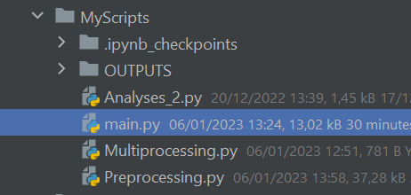
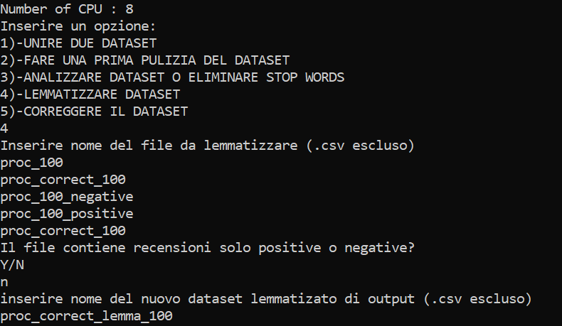
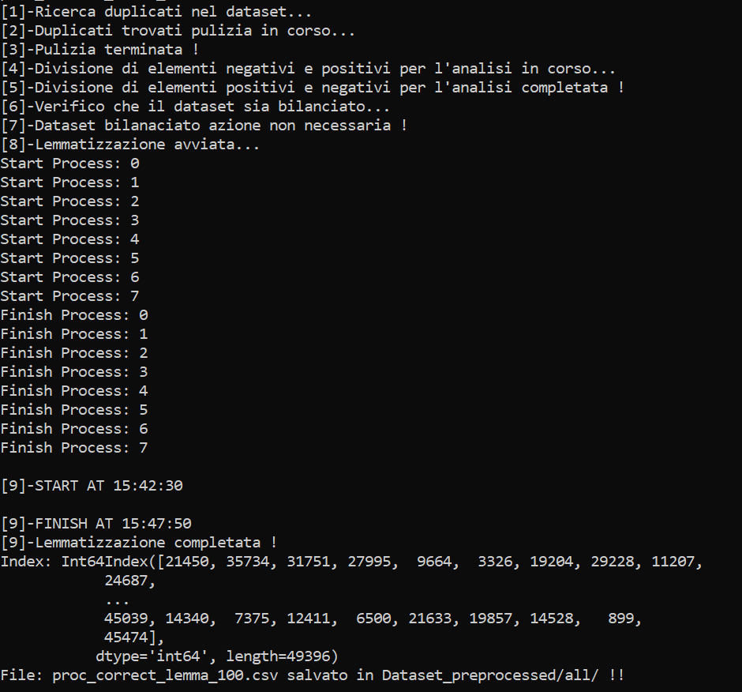

# Analysis_and_processing
 
 __Performs a statistical analysis of the dataset and has more options:__ 
     
    1)-Merges two datasets.
    2)-Performs a first cleanup of the dataset.
    3)-Analyze and possibly eliminate stop words.
    4)-Lemmatize.
    5)-Correct.

## The steps must be performed in order otherwise the output dataset will not be reliable!
## First step:
***We will remove special characters, websites, emails, html code and all the contractures of the English language.***
***First we go to the first file and write on the first line : True.***

***If we want to add expressions to be replaced by regex we have to open the regex file and modify its content.***

***The correct syntax for substitution is:***

***expression_to_find – expression_to_replace_with_space***

***or if the expression to replace has only one word***

***expression_to_find – expression_to_replace,***

***Next we launch main.py.***

***Then we insert the following Input:***

***Output:***

***Input:***

## Second step:

***This option corrects the supplied text, dividing it into 8 datasets and concatenating them to return the requested dataset.***
***With 8 cores it took 9 hours for 60MB of datset!!***
***It is highly expensive in terms of: cpu, memory and execution time.***
***I recommend doing this only if necessary.***

***Input:***

***Output:***

***In the source code I removed the print to optimize the algorithm***

## Third step:
***Let's lemmatize by trimming the dataset a bit and replacing each compound word with its own root***

***Input:***

***Input in the case of partial lemmatization***

***Output***

***Input:***

## Fourth step:
***In this case it is not necessary but in case we have cleaned and lemmatized only the positive or negative***
***reviews, we need to merge the dataset to proceed to the analysis phase.***

***As we can see the union dataset weighs less because it has eliminated the stop words separately for positive and negative***

## Fifth step:
***This is the most important step because it allows you to greatly lighten the lemmatized and clean dataset.***
***To add new stopwords beyond those already present in the repository just add the words in the text files:***

***Input:***

***Output:***

***We can see how many positive and negative reviews the dataset has and perform word-cloud or ngrams analysis.***
***Below are some images that show the effectiveness of the previous phases and some information***
***invaluable for building personalized wordlists.***

***Positive and negative review count:***

***Most Meaningful Words for Word Cloud:***

***Negative:***

***Positive:***

***Most common words in the dataset:***

***Positive:***

***Negative:***

***Most common words in the dataset with NGRAMS 2:***

# CONCLUSIONS:

***At this point we can say that we have created a complete tool that allows us to analyze and modify the dataset.***
***I will show in another repository another useful tool for vectorization and search by tuning hyperparameters with GridSearchCV.***

***Link:*** https://github.com/insidbyte/Analysis_And_Generation_Model_ML

***Link documentation of this repository:*** https://scikit-learn.org
